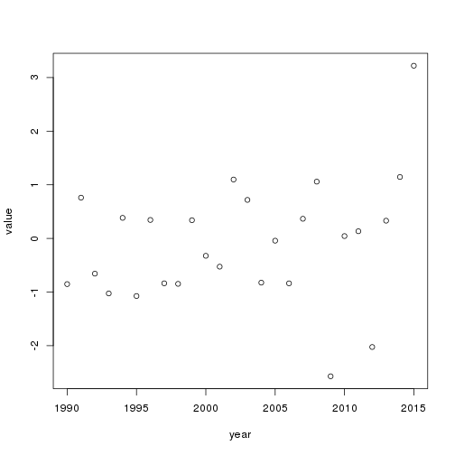

1 Introduction
==============

We can type the introduction to our report here.

2 Some calculations
===================

``` r
x<-4
x
```

    ## [1] 4

``` r
x*2
```

    ## [1] 8

What if we just want to print the output of the R code, but not the code itself?

    ## [1] 16

Or perhaps we want to give some code but don't want to include the output - perhaps it is lengthy or we want students to fill in the answer.

``` r
x+20
```

3 Some Plots
============

Lets make a plot

``` r
year<-seq(1990,2015)
value<-rnorm(26)
plot(year,value)
```



4 Conclusion
============

Using a few relatively simple commands, we can combine text and R code and generate a report.
